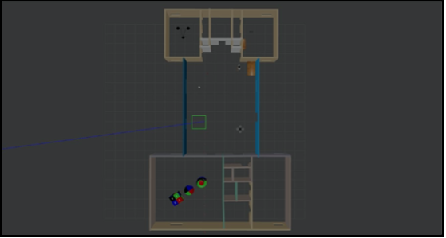
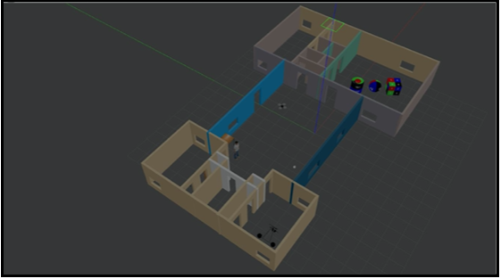
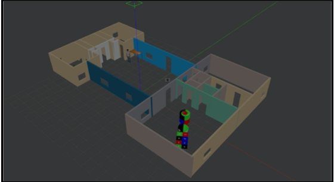

# gazebo_ros
ROS package that will load a world and a building with a Turtlebot3 in it. It adds a camera to the Turtlebot3 to get a stream of video and also autonomusly traverses the building.

## Getting Started

In this project, I used the Gazebo simulator (http://gazebosim.org/), to build my own robot models as well as environments to perform some experiments. Gazebo is available with ROS distribution and can be used out-of-box. Gazebo simulator is helpful in many cases where you need to quickly test your algorithm in a relatively complex environment before deploying it onto a real robot.

A ROS package is created that will load a world and a building or a room with a Turtlebot3 in it. Turtlebot3 robot models in Gazebo do not come with a camera. So you need to add a camera sensor to a Turtlebot model of your choice in any configuration. I have modified the turtlebot sensor stack to inlcude the camera sensor. Finally, created a node that will move the Turlebot based on your last name initials. The first part of this project is mainly designed to allow you to get familiar with Gazebo and Turtlebot3 so that you can implement more complex perception and decision making behaviors on the robot.

Resources : 

* [Gazebo Tutorials](http://gazebosim.org/tutorials/browse)
* [Turtlebot3 ROS package](http://wiki.ros.org/turtlebot3)


### Prerequisites

```
ROS Kinetic
Ubuntu 16.04
python 3
```

### Part 1 : Gazebo world creation




## Steps on Scene/World Construction
* A basic floor-plan as observed above was traced using the building editor module of the Gazebo software. After importing the image of the floor plan into the building editor, the resolution (px/m) was set automatically after tracing the first wall and determining its actual dimension.
* Furthermore, windows, doors and wall textures were added appropriately to the 2D floor-plan and 3D-model.
* Finally, after the final draft of the building was completed, it was saved as a model to be imported later into the scene/world file.
* Returning back to the main gazebo canvas, the procedure to design the world/scene was executed. Numerous models namely, “Cube 20k”, “Hammer”, “Table”, “Tricycle”, “Textured Shapes”, “Tennis ball” and “Book-shelf”, were imported into the building model imported priorly.
* Physical properties,static attributes and visual/collisions were assigned to the respective models while finalizing the scene structure.
* Lastly, the world file was saved and recalled later for simulations with TurtleBot3. Proceedings of the same have been discussed and practiced in “Task 2” of the project.

### Part 2 : Traversing a turtlebot in the world

Video Link :
https://drive.google.com/file/d/1ZX4CsUb3hUpyc3MDwNTIs3dBUIlGITVZ/view?usp=sharing

The first approach towards constructing the node was with tele-operation and noting down what moves to take and later translating it to a python program. But as the bot behaves differently in tele-operation and when running from a program, passing the arguments to the function in the program is the final method.
* The code is a combination of 2 different programs from the Turtlebot tutorials with little changes to accommodate for the required functionality. The program is called with the main function which calls the function inside it with hardcoded values that makes the bot traverse a little and trace the initial ’S’ at last.
* The bot doesn’t travel to any room as there were many discrepancies between its behavior even with minor changes in values. All of us have tried our best to control it and provide a demo of the traversal of the bot.
* To run the code, put the ‘​ros598.launch​’ file in the following directory: turtlebot3——> turtlebot3_bringup——>launch
* Open a terminal and run the command: 
```
roslaunch turtlebot3_bringup ros598.launch
```
❖ Open another terminal and run:
```
rosun image_view image_view image:=/rrbot/camera1/image_raw
```
❖ Open another terminal and run: 
```
rosrun tb3ini 1.py
```

### Installing

A step by step series of examples that tell you how to get a development env running

On Ubuntu 16.04 LTS

```
mkdir gazebo_ros
cd gazebo_ros
git clone https://github.com/gautam-sharma1/gazebo_ros.git
```


## Built With

* [ROS](https://www.ros.org) - Used for simulation environment
* [python](https://www.python.org) - Used for programming

## Authors

* **Gautam Sharma** - *Initial work* - [Github](https://github.com/gautam-sharma1)


## License

This project is licensed under the MIT License - see the [LICENSE.md](LICENSE.md) file for details


